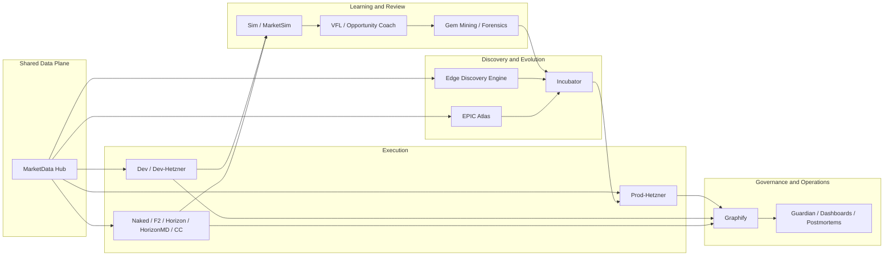

# Robo-T-Rader

AI-assisted platform for autonomous trading edge discovery, governance, and operation.

## OpenAI Build Week 2026 submission

This repository is the canonical competition-facing entry point for Robo-T-Rader.

Its job is simple:

- explain the ecosystem clearly
- distinguish pre-existing work from Build Week work
- show how Codex and GPT-5.6 were used
- give judges one coherent place to start

Robo-T-Rader is not presented here as a single trading bot. It is presented as a platform that helps a technical team discover, validate, incubate, govern, and operate autonomous trading systems.

## Track

`Work & Productivity`

Why:
the strongest contribution is workflow and operating infrastructure for autonomous systems, using trading as the real-world domain.

## What Robo-T-Rader is

Robo-T-Rader is a modular ecosystem made of:

- live trading environments
- a shared market data plane
- discovery and incubation modules
- simulation and replay tooling
- governance and observability layers
- dashboards and support processes

Together, these modules turn trading automation into an engineering workflow rather than a black box.

## Ecosystem at a glance

## Why judges should care

- This is not only a trading runtime. It is a workflow platform for autonomous systems.
- The platform separates data, operation, review, discovery, and promotion.
- Build Week value lives in the platform layer, not only in one robot or one trade.

## Main components

### Execution environments

- Dev
- Dev-Hetzner
- Prod-Hetzner
- Naked
- F2
- Horizon
- HorizonMD
- CC

### Shared data plane

- MarketData Hub

### Discovery and evolution

- Edge Discovery Engine
- Incubator
- EPIC Atlas

### Learning and review

- Sim
- MarketSim
- VFL
- Opportunity Coach
- Gem Mining
- Forensics

### Governance and operations

- Graphify
- Guardian
- dashboards
- postmortems
- parity and replay flows

See the full module inventory in [Modules](docs/MODULES.md).

## What existed before Build Week

Before OpenAI Build Week, Robo-T-Rader already had:

- multiple live and lab robot environments
- demo trading workflows
- Telegram monitoring and control
- postmortem and replay practices
- infrastructure across robo-lab and Hetzner

This submission does **not** claim that the entire platform was built during Build Week.

## What was built or meaningfully extended during Build Week

The Build Week submission focuses on platform-level extensions such as:

- stronger use of MarketData Hub as a shared contract surface
- EPIC Atlas integration against Hub contracts
- read-only pilot flows for Atlas
- edge discovery and incubator workflow formalization
- competition-grade system documentation
- clearer platform story centered on productivity, governance, and continuous edge evolution

## Demo focus

The main live demo surface is:

- `Prod-Hetzner`

The supporting modules shown in the presentation and video are:

- MarketData Hub
- Sim / MarketSim
- VFL
- Opportunity Coach
- Gem Mining
- Graphify
- Edge Discovery Engine
- EPIC Atlas

## How Codex and GPT-5.6 were used

Codex and GPT-5.6 were used as active engineering collaborators:

- reading and synthesizing existing codebases
- designing integration contracts
- refactoring architecture boundaries
- debugging runtime and infrastructure behavior
- structuring edge discovery workflows
- writing and refining technical documentation

## How to use this repository

Start here:

- [Architecture](docs/ARCHITECTURE.md)
- [Modules](docs/MODULES.md)
- [Build Week Evidence](docs/BUILD_WEEK_EVIDENCE.md)
- [Demo Plan](docs/DEMO_PLAN.md)
- [Repository Strategy](docs/REPOSITORY_STRATEGY.md)
- [PowerPoint Story](docs/POWERPOINT_STORY.md)

## Supporting repositories

These are supporting modules, not separate submissions:

- `robo-t-rader-platform`
  Public canonical submission repo:
  `https://github.com/lmfranchini/robo-t-rader-platform`
- `EpicAtlas`
  Canonical support repo, currently treated as private support infrastructure
- `marketdatahub`
  Canonical support repo, currently treated as private support infrastructure
- `edge-discovery-engine`
  Support module, currently treated as private support infrastructure
- `graphify`
  Support module, currently treated as private support infrastructure
- `robo-t-rader_prod`
  Support module, currently treated as private support infrastructure
- `robo-t-rader_naked`
  Support module, currently treated as private support infrastructure

Their role is explained in [Repository Strategy](docs/REPOSITORY_STRATEGY.md).

## Required submission fields

Before final submission, fill in:

- main public repository URL
- Codex main thread ID: `019e3cc2-773c-7bb0-9b29-79b83dbad1ba`
- final demo video URL
- exact public GitHub links only for the supporting modules you decide to expose

## Honest framing

Robo-T-Rader is a pre-existing system that was meaningfully extended during OpenAI Build Week.

Judges should evaluate the documented Build Week work: the platform extensions, contract work, pilot activation, discovery workflows, and ecosystem-level engineering contribution.
